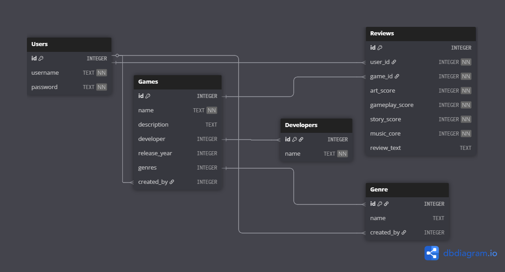

# PlayScore

This app is a project created for the University of Helsinki's TKT20019 - Databases and Web Programming course (Summer/2025). It uses Python, the Flask framework, and an SQLite database to provide basic functionality for submitting and viewing gaming reviews. Please note that the features are limited to these technologies, focusing on simple interactions like submitting reviews, rating games, and browsing content.

## Application features

-   Users can create an account and log in to the app.
-   Users can add, edit and delete game reviews.
-   Users can see all the other peoples entries.
-   Users can search for entries using keywords or other filters and categorize them with one or more tags or genres.
-   The user's page displays statistics, e.g the number of reviews submitted and average score given.
-   Users can add secondary data or related entries to a primary entry.

Create a virtual environment

```
$ python3 -m venv venv

Linux:
$ source venv/bin/activate

Windows:
$ venv\Scripts\activate
```

Install flask library

```
$ pip install flask
```

Create a database and initialize the database schema

```
$ python install.py
```

Start the Flask app

```
$ flask run
```

## Database Diagram

_Last Updated: 20.7.2025_


